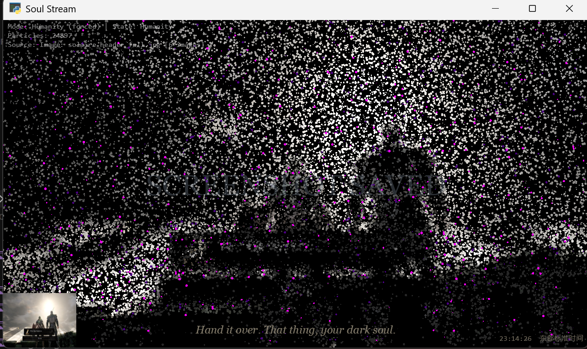
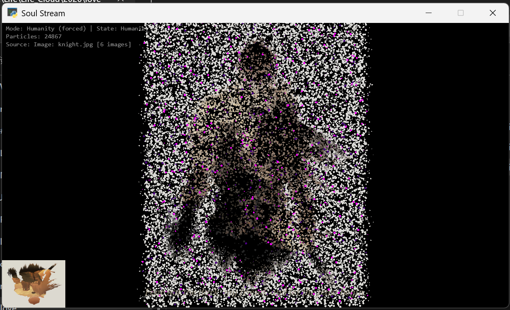
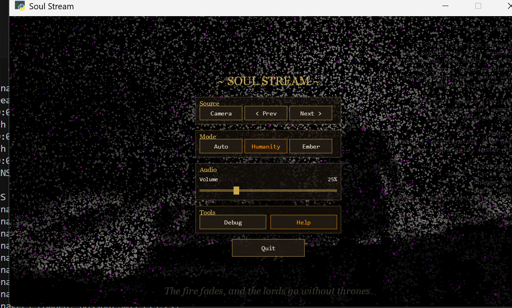

# SoulStream开发日志（1）

02/13/2026

各位不死人情人节好，这里是溯流光，我来分享一个开源项目，[SoulStream](https://github.com/DarkSoulsAI/SoulStream)，一个黑魂主题的实时粒子可视化器

## 这玩意是啥？

玩魂系列的时候，总被那些篝火余烬飘散、灵魂升腾的画面所打动。我想：能不能把这种视觉感受做成一个实时的、可交互的程序？于是 SoulStream 诞生了


简单来说：把黑魂的原画丢进去，程序会自动识别画面中的边缘和轮廓，然后在这些位置生成粒子。25000个粒子像灵魂一样从画面里升腾而起，每一个粒子都携带着原图采样的色彩

效果嘛……就是这样：


**余火模式**——"HEIR OF FIRE RESTORED"，满屏金色火星往上飘，配合古龙吟唱BGM 



**人性模式**——粒子变成冷灰色调，漂浮得很慢很安静，偶尔闪一下洋红和靛蓝色的光。左下角是原图预览，右下角滚动显示魂系列经典台词

## 两个模式自动切换

程序会自动在人性/余火两个模式之间循环。人性模式持续12秒，余火模式持续8秒，切换的瞬间屏幕中间会弹出黑魂风格的大字提示——"HUMANITY RESTORED" 或 "HEIR OF FIRE RESTORED"，配上对应的音效。

当然也可以手动按空格强制切换，还有摄像头模式,**张开手掌就能触发余火**，掌心会喷射橙金色火花，周围的粒子也会被染成从金黄到深红的火焰渐变。是的，你可以用手点燃篝火（大概）。



这张图是人性模式下骑士原画的效果，开了debug面板所以能看到左上角的状态信息和左下角原图预览。25000个粒子勾勒出骑士的轮廓，边缘越明显的地方粒子越密集。

## 黑魂风格GUI

按TAB键会弹出一个魂系列风格的菜单界面：



摄像头开关、切图、模式选择、音量调节、debug面板……该有的都有。这个UI的设计参考了黑魂的菜单风格，金色标题 + 暗色半透明背景。

## 音效很重要！

每个操作都有对应的魂系列音效：
- 切模式 → 痛苦低吟
- 开摄像头 → "Hello Dark Souls"
- 切图 → 篝火点燃的声音
- 按帮助 → 防火女独白
- 退出 → "Thank you Dark Souls"
- 张开手掌 → Boss战开场音效


## 开发工作流

尝鲜vibe coding, 这次我高度依赖Claude Code,用了一套AI多工具协作的打法：

- **Gemini** 负责前期规划和架构设计，帮我理清楚整个系统要怎么拆分
- **Claude Code** 是主力编码工具，粒子系统、图像处理、着色器、音效管理这些核心模块基本都是在Claude Code里写的，效率非常高
- **Cursor** 用来调试，遇到渲染bug或者架构过于复杂的时候切到Cursor里排查
<!-- - **NanoBanana** 画架构图和数据流图，理清粒子系统、摄像头、手势追踪之间怎么串起来 -->
- **在线资源**：音效素材和黑魂原画图片都是从网上搜集的


核心思路就是**让每个工具干它最擅长的事**。规划找Gemini，写代码找Claude Code，调bug找Cursor，画图找NanoBanana。体感下来，效率大大提升， 一天出基本demo, 不过还是需要调整效果


## 项目结构
项目开源在这里: [SoulStream](https://github.com/sourcelight/SoulStream)

```bash
SoulStream/
├── main.py          # 主程序入口 + 音效/UI/模式控制
├── particles.py     # 25K 粒子系统（NumPy 向量化）
├── image_source.py  # 图像处理管线（Canny/Sobel/亮度）
├── camera.py        # 摄像头采集
├── hand_tracker.py  # MediaPipe 手部追踪
├── gui.py           # 游戏风格菜单 UI
├── shaders/         # GLSL 顶点/片段着色器
├── image/           # 黑魂原画素材
└── audio/           # 音效文件
```


## 下一步计划？

- 更多粒子特效（Boss战模式？薪王化身？）
- 音频节奏联动，让粒子跟着BGM节拍跳动
- 更多手势交互（赞美太阳？喝果粒橙？）
- 多人联机篝火？（想多了）

---

*"Don't you dare go hollow."*

欢迎各位不死人在评论区提供建议, 也欢迎在GitHub上提交Issue或PR. 

传火不止，代码不息, 我们下个存档见


