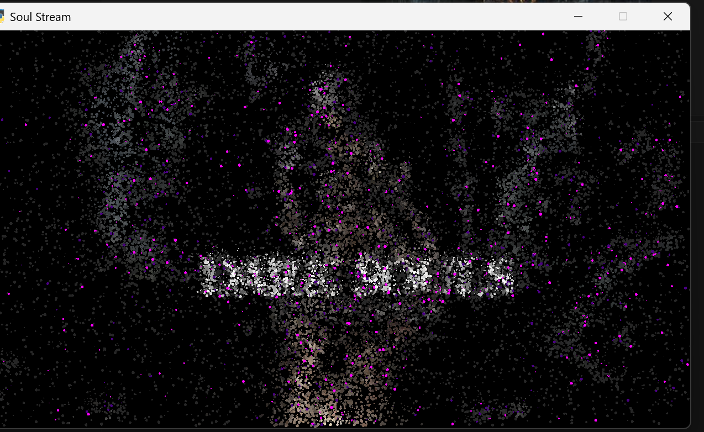

# Soul Stream

A Dark Souls-themed particle visualizer. 25,000 particles rise from edge-detected artwork like freed souls, driven by Canny edges, Sobel gradients, and brightness maps.



## Setup

```
pip install -r requirements.txt
python main.py
```

Requires Python 3.10+ and an OpenGL 3.3 capable GPU.

## Controls

| Key | Action |
|-----|--------|
| `SPACE` | Cycle modes (Auto / Humanity / Ember) |
| `LEFT` `RIGHT` | Change source image |
| `C` | Toggle webcam input |
| `D` | Debug overlay |
| `H` | Help panel |
| `ESC` | Quit |

## Modes

- **Humanity** — desaturated palette, slow upward drift
- **Ember** — warm gold tones, faster particle rise

In Auto mode the system cycles between them. With webcam active, motion triggers Ember.

## Images

Drop `.jpg` / `.png` / `.webp` files into the `image/` folder. The app loads all images found there and cycles through them with arrow keys.

## Project Structure

```
main.py          — window, render loop, overlay system
particles.py     — particle spawning, physics, GPU packing
image_source.py  — image loading, edge detection, color sampling
camera.py        — webcam capture + motion detection
shaders/         — GLSL vertex/fragment shaders
image/           — source artwork
```
