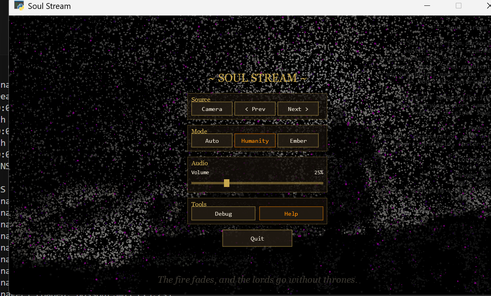
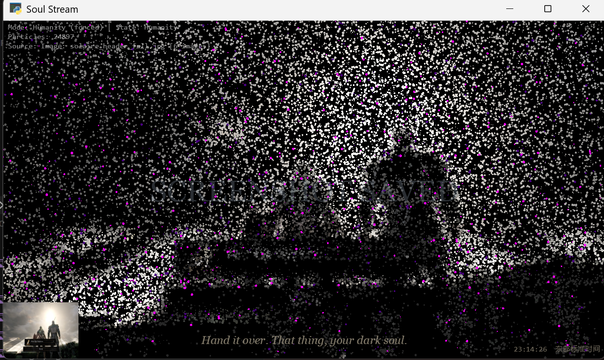
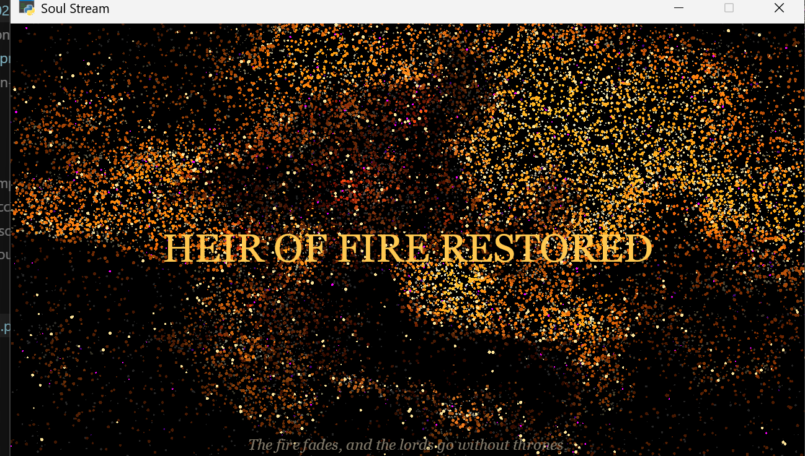

# Soul Stream

A Dark Souls-themed particle visualizer. 25,000 particles rise from edge-detected artwork like freed souls, driven by Canny edges, Sobel gradients, and brightness maps.


## Setup

```
pip install -r requirements.txt
python main.py
```

Requires Python 3.10+ and an OpenGL 3.3 capable GPU.

## Controls

| Key | Action |
|-----|--------|
| `SPACE` | Cycle modes (Auto / Humanity / Ember) |
| `LEFT` `RIGHT` | Change source image |
| `C` | Toggle webcam input |
| `D` | Debug overlay |
| `H` | Help panel |
| `S` | Save screenshot to `result/` |
| `TAB` | Toggle GUI menu overlay |
| `F11` | Toggle fullscreen |
| `ESC` | Quit |

## GUI Menu

Press `TAB` to open a Dark Souls-themed interactive overlay with clickable buttons and a volume slider — no keyboard shortcuts required.



Panels: **Source** (camera/image switching), **Mode** (Auto/Humanity/Ember), **Audio** (volume slider), **Tools** (debug/help toggles), and **Quit**. Hover any button for a tooltip description.

## Screenshots

Press `S` to save the current frame to the `result/` folder. Files are auto-named with timestamp, source image, mode, and state — e.g. `20260213_143022_darksouls1_auto_humanity.png`.

## Window Controls

The window supports standard minimize, maximize, and close buttons. Maximize resizes the GUI and all overlays to fill the screen. `F11` toggles true fullscreen.



A wall clock with auto-detected timezone is displayed in the bottom-right corner.

## Modes

- **Humanity** — desaturated palette, slow upward drift
- **Ember** — warm gold tones, faster particle rise



In Auto mode the system cycles between them. With webcam active, motion triggers Ember.

## Images

Drop `.jpg` / `.png` / `.webp` files into the `image/` folder. The app loads all images found there and cycles through them with arrow keys.

## Project Structure

```
main.py          — window, render loop, overlay system
gui.py           — Dark Souls themed GUI overlay (buttons, slider, menu)
particles.py     — particle spawning, physics, GPU packing
image_source.py  — image loading, edge detection, color sampling
camera.py        — webcam capture + motion detection
shaders/         — GLSL vertex/fragment shaders
image/           — source artwork
result/          — saved screenshots
```
