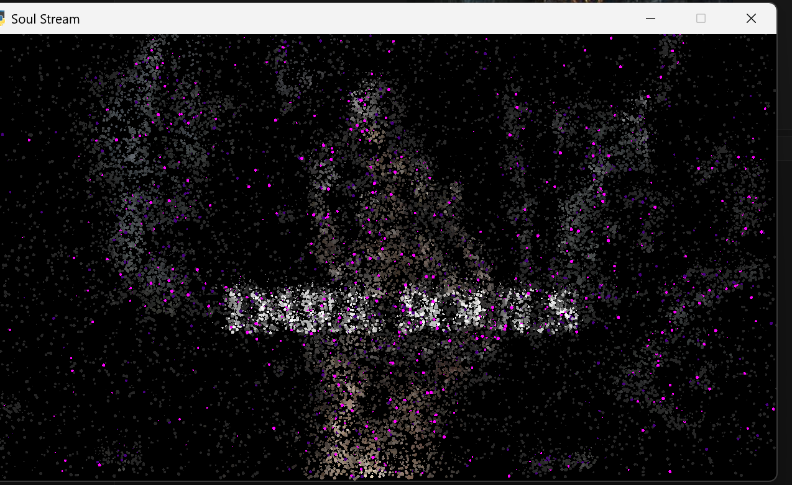
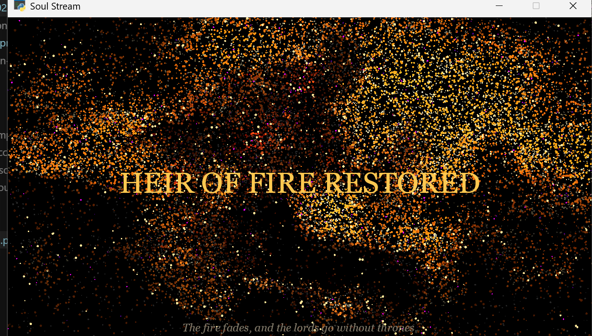

# Soul Stream

A Dark Souls-themed particle visualizer. 25,000 particles rise from edge-detected artwork like freed souls, driven by Canny edges, Sobel gradients, and brightness maps.



## Setup

```
pip install -r requirements.txt
```

Download the MediaPipe model files into the project root (not included in git):

```
curl -L -o hand_landmarker.task https://storage.googleapis.com/mediapipe-models/hand_landmarker/hand_landmarker/float16/latest/hand_landmarker.task
curl -L -o pose_landmarker_lite.task https://storage.googleapis.com/mediapipe-models/pose_landmarker/pose_landmarker_lite/float16/latest/pose_landmarker_lite.task
```

```
python main.py
```

Requires Python 3.10+ and an OpenGL 3.3 capable GPU.

## Controls

| Key | Action |
|-----|--------|
| `SPACE` | Cycle modes (Auto / Humanity / Ember) |
| `LEFT` `RIGHT` | Change source image |
| `C` | Toggle webcam input |
| `H` | Hand tracker toggle (only active with webcam) |
| `P` | Pose detector toggle (only active with webcam) |
| `B` | Toggle Bonfire Palm interaction HUD/effect |
| `V` | Cycle visualization mode |
| `1` – `5` | Jump to visualization mode directly |
| `D` | Debug overlay |
| `F1` | Help panel |
| `S` | Save screenshot to `result/` |
| `TAB` | Toggle GUI menu overlay |
| `F11` | Toggle fullscreen |
| `ESC` | Quit |

## GUI Menu

Press `TAB` to open a Dark Souls-themed interactive overlay with clickable buttons and a volume slider — no keyboard shortcuts required.


Panels: **Source** (camera/image switching), **Camera Features** (hand tracker / pose detector toggles), **Interaction** (Bonfire Palm), **Mode** (Auto/Humanity/Ember), **Visualization** (5 modes), **Audio** (volume slider), **Tools** (debug/help toggles), and **Quit**. Hover any button for a tooltip description.

## Visualization Modes

| # | Mode | Description |
|---|------|-------------|
| 1 | Points | Circular glowing point cloud (original) |
| 2 | Trails | Particles leave fading line-segment tails |
| 3 | Skeleton | MediaPipe hand/body skeleton rendered in Dark Souls gold glow |
| 4 | Flow | Curl-noise velocity field bends particle paths into ribbons |
| 5 | Shapes | Rotating triangle sigils derived from live particle positions |

Switch with `V` (cycle) or `1`–`5` (direct). A banner confirms the active mode.

## Camera Features

When the webcam is active (`C`), you can independently toggle:

- **Hand Tracker** (`H` or menu) — open-palm detection kindles nearby particles; toggling off saves CPU.
- **Pose Detector** (`P` or menu) — 7 poses trigger visual effects (Praise the Sun, YOU DIED, etc.); toggling off saves CPU.
- **Bonfire Palm** (`B` or menu) — turns an open palm into a product HUD with palm reticle, kindle radius, charge, and Palm -> Sun mapping.

Both start enabled. Turn off whichever you don't need for a lighter experience.

## Screenshots

Press `S` to save the current frame to the `result/` folder. Files are auto-named with timestamp, source image, mode, and state — e.g. `20260213_143022_darksouls1_auto_humanity.png`.

## Window Controls

The window supports standard minimize, maximize, and close buttons. Maximize resizes the GUI and all overlays to fill the screen. `F11` toggles true fullscreen.


A wall clock with auto-detected timezone is displayed in the bottom-right corner.

## Modes

- **Humanity** — desaturated palette, slow upward drift
- **Ember** — warm gold tones, faster particle rise



In Auto mode the system cycles between them. With webcam active, motion triggers Ember; an open palm sustains it.

## Images

Drop `.jpg` / `.png` / `.webp` files into the `image/` folder. The app loads all images found there and cycles through them with arrow keys.

## Project Structure

```
main.py                  — thin launcher
test_pose.py             — standalone webcam pose debug tool
test_hand_tracker.py     — standalone webcam hand debug tool
src/
  app.py                 — SoulStreamApp (window, render loop, input)
  overlays.py            — SoundManager, ModeController, all overlay classes
  visualization.py       — 5 visualization renderers
  gui.py                 — Dark Souls themed GUI (buttons, slider, panels)
  particles.py           — particle spawning, physics, GPU packing
  camera.py              — webcam capture, hand/pose feature flags
  image_source.py        — image loading, edge detection, color sampling
  hand_tracker.py        — MediaPipe hand landmark detection
  pose_tracker.py        — MediaPipe body pose detection (7 poses)
shaders/                 — GLSL vertex/fragment shaders
image/                   — source artwork
result/                  — saved screenshots
```
